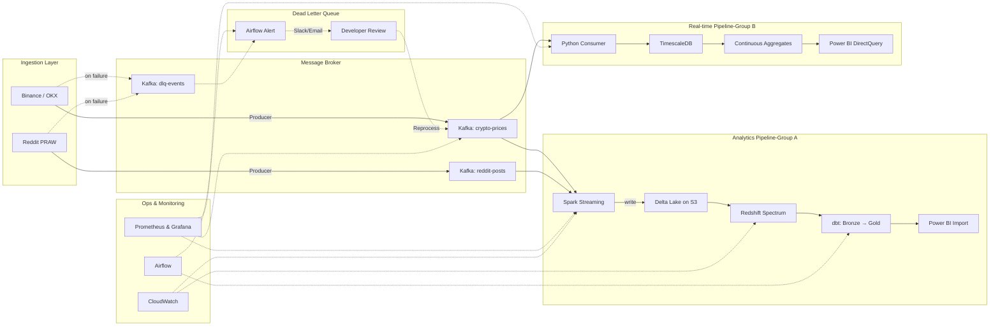

# Real-Time Cryptocurrency Data Pipeline with Sentiment Analysis

[]()
[]()
[]()
[]()
[]()
[]()

Repository này chứa một **đường ống dữ liệu crypto thời gian thực** sẵn sàng cho production, thu thập dữ liệu giao dịch trực tiếp từ các WebSocket của Binance và OKX, làm giàu dữ liệu với cảm xúc từ Reddit (sử dụng **LLM** local), và cung cấp dữ liệu cho cả dashboard độ trễ thấp lẫn phân tích lịch sử. Pipeline được thiết kế theo kiến trúc **Lambda-inspired** với hai consumer group độc lập, mô hình dữ liệu **Medallion**, và hoàn toàn miễn phí trong 2–3 tuần nhờ Docker, AWS Free Tier và Redshift credits.

---

## Mục lục

- [Tổng quan kiến trúc](#tổng-quan-kiến-trúc)
- [Cấu trúc thư mục](#cấu-trúc-thư-mục)
- [Các thành phần & Công nghệ](#các-thành-phần--công-nghệ)
- [Hướng dẫn cài đặt](#hướng-dẫn-cài-đặt)
- [Cấu hình & Tùy chỉnh](#cấu-hình--tùy-chỉnh)
- [Ứng dụng mẫu](#ứng-dụng-mẫu)
- [Xử lý sự cố & Lưu ý thêm](#xử-lý-sự-cố--lưu-ý-thêm)
- [Đóng góp](#đóng-góp)
- [Giấy phép](#giấy-phép)
- [Ghi chú cuối](#ghi-chú-cuối)

---

## Tổng quan kiến trúc

Pipeline được xây dựng với hai nhóm consumer độc lập cùng đọc từ các **Kafka topics**, phục vụ các yêu cầu về độ trễ khác nhau. Toàn bộ dữ liệu được lưu trữ theo mô hình **Medallion** (Bronze → Silver → Gold) cho phân tích, trong khi một luồng real-time đưa dữ liệu vào **TimescaleDB** để phục vụ dashboard tức thời.

### Kiến trúc tổng thể



### Luồng Batch & Streaming

- **Luồng Batch** (Consumer Group A):  
  **Spark Structured Streaming** đọc từ `crypto-prices` và `reddit-posts`, áp dụng watermark, deduplication, validation, sau đó gọi một **FastAPI micro-service** (chạy **Ollama** với model **Qwen2.5-7B**) để gán nhãn sentiment. Dữ liệu đã làm sạch được ghi vào **Delta Lake** trên S3. **Redshift Spectrum** query trực tiếp các bảng Delta, và **dbt** biến đổi chúng qua các tầng Bronze → Silver → Gold. Dữ liệu Gold được đưa vào Power BI (Import mode).

- **Luồng Streaming** (Consumer Group B):  
  Một **Python consumer** nhẹ đọc từ `crypto-prices`, thực hiện ghi idempotent vào **TimescaleDB** (hypertable), và tạo các continuous aggregates cho OHLCV 1 phút / 5 phút. Power BI kết nối qua DirectQuery để có độ trễ dưới giây.

- **Dead Letter Queue (DLQ)**:  
  Các message bị lỗi sau khi retry được đẩy vào topic `dlq-events`. Airflow giám sát topic này mỗi 5 phút và cảnh báo qua Slack/Email. Các message không hợp lệ có thể được phát lại hoặc ghi vào bảng audit.

- **Giám sát & Quản trị**:  
  **Prometheus + Grafana** theo dõi Kafka lag, thời gian batch của Spark, metrics TimescaleDB. **CloudWatch** thu thập log từ Spark và Redshift. **Airflow** lên lịch chạy dbt, VACUUM Delta Lake, và đồng bộ manifest.

---

## Cấu trúc thư mục

```
crypto-streaming-pipeline/
├── .github/workflows/          # CI/CD với GitHub Actions
├── airflow/
│   ├── dags/
│   │   ├── dbt_run_dag.py          # Chạy dbt models mỗi 2h
│   │   ├── delta_vacuum_dag.py     # VACUUM hàng ngày & đồng bộ manifest
│   │   └── dlq_monitor_dag.py      # Kiểm tra DLQ mỗi 5 phút
│   ├── Dockerfile
│   └── requirements.txt
├── docker-compose.yml           # Toàn bộ services (Kafka, Spark, TimescaleDB, v.v.)
├── great_expectations/          # (Tùy chọn) Kiểm tra chất lượng dữ liệu
├── kafka/
│   ├── producer_binance.py      # WebSocket → Kafka
│   ├── producer_reddit.py       # PRAW → Kafka
│   └── dlq_consumer.py          # (Mẫu) xử lý lại DLQ
├── kubernetes/                  # (Tùy chọn) Manifests cho K8s
├── monitoring/
│   ├── prometheus.yml
│   └── grafana_dashboards/
├── spark/
│   ├── Dockerfile
│   ├── spark_streaming_job.py   # Group A: đọc Kafka → làm sạch → gọi LLM → ghi Delta
│   └── requirements.txt
├── timescale/
│   ├── consumer.py               # Group B: Kafka → TimescaleDB
│   └── init.sql                  # Tạo hypertable
├── llm_service/
│   ├── app.py                    # FastAPI + Ollama (Qwen2.5-7B)
│   ├── Dockerfile
│   └── requirements.txt
├── dbt/                           # dbt models (Redshift)
│   ├── models/
│   │   ├── bronze/
│   │   ├── silver/
│   │   └── gold/
│   └── profiles.yml
├── scripts/
│   └── init_redshift_spectrum.sql # Tạo external schema trên Redshift
├── terraform/                     # (Tùy chọn) Provision AWS
└── README.md                      # Bạn đang đọc file này
```

---

## Các thành phần & Công nghệ

| Nhóm                    | Công cụ                                                                 | Mục đích                                                |
|-------------------------|-------------------------------------------------------------------------|---------------------------------------------------------|
| **Thu thập dữ liệu**    | Python 3.11, websockets, PRAW                                           | Kết nối WebSocket Binance/OKX & Reddit API              |
| **Message Broker**      | Apache Kafka 3.x (KRaft mode)                                           | Hàng đợi tin nhắn đáng tin cậy, hỗ trợ DLQ              |
| **Xử lý stream**        | Spark Structured Streaming 3.5                                          | Xử lý micro‑batch, watermark, deduplication              |
| **Phân tích cảm xúc**   | Ollama + Qwen2.5-7B (Q4_K_M), FastAPI                                   | LLM local cho slang crypto                               |
| **Database real‑time**  | TimescaleDB 2.x (dựa trên PostgreSQL)                                   | Hypertables, continuous aggregates, truy vấn độ trễ thấp |
| **Data Lake**           | Delta Lake 3.x trên AWS S3                                              | ACID transactions, time travel, lưu trữ dạng cột         |
| **Query engine**        | Redshift Serverless + Spectrum                                          | Truy vấn trực tiếp Delta Lake trên S3, không cần tải dữ liệu |
| **Biến đổi dữ liệu**    | dbt (data build tool) + Redshift                                        | Các tầng Medallion (Bronze → Silver → Gold)              |
| **Điều phối**           | Apache Airflow 2.x                                                      | Lên lịch dbt, VACUUM, đồng bộ manifest, cảnh báo DLQ    |
| **Giám sát**            | Prometheus + Grafana, AWS CloudWatch                                    | Metrics, logs, và cảnh báo                               |
| **CI/CD**               | GitHub Actions                                                          | Kiểm thử và triển khai tự động                           |
| **Hạ tầng**             | Docker, Docker Compose, AWS (S3, Redshift, IAM)                        | Phát triển local + analytics trên cloud                  |

---

## Hướng dẫn cài đặt

### Yêu cầu tiên quyết

- **Docker** và **Docker Compose** (bản v2.20+)
- **Python 3.11** (tùy chọn, để chạy script local)
- **Tài khoản AWS** có Free Tier (S3, CloudWatch) và **Redshift 300‑credit trial** (hoặc dùng credit riêng)
- **Reddit API credentials** (client ID & secret) – [lấy tại đây](https://www.reddit.com/prefs/apps)
- Tối thiểu **32 GB RAM** (khuyến nghị cho LLM local + Spark)

### Các bước cài đặt

1. **Clone repository**
   ```bash
   git clone https://github.com/yourname/crypto-streaming-pipeline.git
   cd crypto-streaming-pipeline
   ```

2. **Tạo file .env với các biến môi trường**
   ```env
   REDDIT_CLIENT_ID=your_client_id
   REDDIT_CLIENT_SECRET=your_secret
   REDDIT_USER_AGENT="crypto-pipeline/1.0"
   AWS_ACCESS_KEY_ID=your_aws_key
   AWS_SECRET_ACCESS_KEY=your_aws_secret
   S3_BUCKET=your-delta-lake-bucket
   REDSHIFT_WORKGROUP=...
   ```

3. **Khởi động toàn bộ services**
   ```bash
   docker-compose up --build
   ```
   Lệnh này sẽ chạy:
   - Kafka (KRaft) trên cổng 9092  
   - Spark master/worker (cổng 8080/8081)  
   - TimescaleDB trên cổng 5432  
   - FastAPI LLM service trên cổng 8000  
   - Airflow trên cổng 8082  
   - Prometheus trên 9090, Grafana trên 3000  
   - (Tùy chọn) MinIO để giả lập S3 nếu chưa dùng AWS

4. **Truy cập các giao diện**
   - **Airflow**: http://localhost:8082 (đăng nhập: `airflow`/`airflow`)  
   - **Grafana**: http://localhost:3000 (admin/admin) – dashboard cho Kafka lag, Spark metrics  
   - **FastAPI docs**: http://localhost:8000/docs  
   - **Spark master**: http://localhost:8080  

5. **Khởi tạo Redshift Spectrum**
   - Chạy script `scripts/init_redshift_spectrum.sql` trong query editor của Redshift để tạo external schema trỏ đến bucket S3 chứa Delta Lake.

6. **Chạy pipeline**
   - **Ingestion**: Các Kafka producer tự động chạy cùng container.
   - **Consumer Group B** (real‑time): Python consumer nằm trong `docker-compose` và tự động ghi vào TimescaleDB.
   - **Consumer Group A** (analytics): Gửi Spark job thủ công hoặc qua Airflow:
     ```bash
     docker exec -it spark-master spark-submit \
       --master spark://spark-master:7077 \
       /opt/spark_jobs/spark_streaming_job.py
     ```
   - **dbt transformations**: Kích hoạt DAG `dbt_run_dag` trong Airflow. Nó sẽ chạy mỗi 2 giờ.

7. **Kiểm tra dữ liệu**
   - **TimescaleDB**: `docker exec -it timescale psql -U postgres -d crypto` – xem bảng `crypto_prices` (hypertable).
   - **Delta Lake**: Dùng Spark SQL hoặc Athena để query S3.
   - **Power BI**: Kết nối tới TimescaleDB (DirectQuery) hoặc Redshift (Import) bằng file `.pbix` mẫu (nếu có).

---

## Cấu hình & Tùy chỉnh

- **Thêm sàn giao dịch khác**: Sửa `kafka/producer_binance.py` để bổ sung WebSocket endpoint.
- **Thay đổi subreddit / keyword mapping**: Sửa `producer_reddit.py` – danh sách `SUBREDDITS` và ánh xạ từ khóa → symbol.
- **Đổi LLM model**: Trong `llm_service/app.py`, thay tham số `model` trong lời gọi Ollama (ví dụ: `llama3`, `mistral`). Nhớ pull model trước: `ollama pull <model>`.
- **Điều chỉnh window size trong Spark**: Sửa `spark_streaming_job.py` – watermark duration, deduplication keys.
- **dbt models**: Thêm các transformation mới trong `dbt/models/`. Chạy thử với `dbt run --select tag:my_model`.
- **Scaling**: Tăng số partition Kafka, số Spark worker, hoặc tài nguyên TimescaleDB trong `docker-compose.yml`.

---

## Ứng dụng mẫu

- **Dashboard giao dịch real‑time**  
  Theo dõi giá BTC/USDT, khối lượng, độ sâu order book với độ trễ <2s dùng Power BI DirectQuery trên continuous aggregates của TimescaleDB.

- **Tương quan Sentiment vs. Giá**  
  Phân tích xem sentiment Reddit (positive/negative/neutral) cho một coin có tương quan với biến động giá trong cửa sổ 5 phút hay không. Các câu lệnh join có sẵn trong TimescaleDB cung cấp dữ liệu này.

- **Phát hiện bất thường (Anomaly Detection)**  
  Dùng Spark streaming để phát hiện các spike giá hoặc volume đột biến và lưu vào bảng `gold.alerts` để hiển thị trong Power BI.

- **Backtesting chiến lược**  
  Query dữ liệu OHLCV (1 phút, 5 phút, 1 giờ) từ tầng Gold trên Redshift để backtest chiến lược giao dịch.

---

## Xử lý sự cố & Lưu ý thêm

- **Kafka không khởi động**: Xem log `docker-compose logs kafka`. Đảm bảo `KAFKA_KRAFT_CLUSTER_ID` đã được sinh (có sẵn trong compose file).
- **Spark thiếu bộ nhớ**: Tăng `SPARK_WORKER_MEMORY` trong `docker-compose.yml`. LLM service được gọi ngoài process để tránh quá tải executor.
- **Giới hạn rate Reddit API**: PRAW tự động xử lý 60 requests/phút. Nếu gặp giới hạn, tăng khoảng thời gian polling trong `producer_reddit.py`.
- **Chi phí Redshift**: Đặt **Max RPU = 8** trong Redshift Serverless console, lên lịch dbt mỗi 2 giờ (không thường xuyên hơn). Tắt workgroup khi không dùng.
- **Small files trong Delta Lake**: Spark job có dùng `OPTIMIZE` và `ZORDER`. Airflow chạy `VACUUM` hàng ngày để dọn file cũ.
- **Dual writes không nhất quán**: Đây là sự đánh đổi cố hữu trong Lambda architecture. Layer real-time (TimescaleDB) có thể chậm hơn layer analytics trong vài phút, nhưng cả hai đều eventual consistent. Dùng idempotent writes để tránh trùng lặp.

---

## Đóng góp

Mọi đóng góp đều được hoan nghênh! Hãy làm theo các bước:

1. Fork repository.
2. Tạo nhánh tính năng (`git checkout -b feature/tinh-nang-moi`).
3. Commit thay đổi (`git commit -m 'Thêm tính năng mới'`).
4. Push lên nhánh (`git push origin feature/tinh-nang-moi`).
5. Mở Pull Request.

Nhớ cập nhật tài liệu và test tương ứng.

---

## Giấy phép

Phân phối dưới giấy phép MIT. Xem `LICENSE` để biết thêm chi tiết.

---

## Ghi chú cuối

> **Lưu ý**  
> Pipeline này được thiết kế để hoàn toàn miễn phí trong 2–3 tuần nhờ Docker, AWS Free Tier và 300‑credit Redshift. Sau thời gian đó, bạn có thể dọn dẹp hoặc chuyển sang môi trường production. Tất cả các thành phần đều là mã nguồn mở và có thể triển khai on‑premises hoặc trên bất kỳ cloud nào.

**Chúc bạn streaming thành công!** Nếu thấy dự án hữu ích, hãy ⭐ repo và chia sẻ với mọi người. Mọi câu hỏi hay góp ý, vui lòng tạo issue.

[⬆️ Quay lại đầu trang](#mục-lục)
